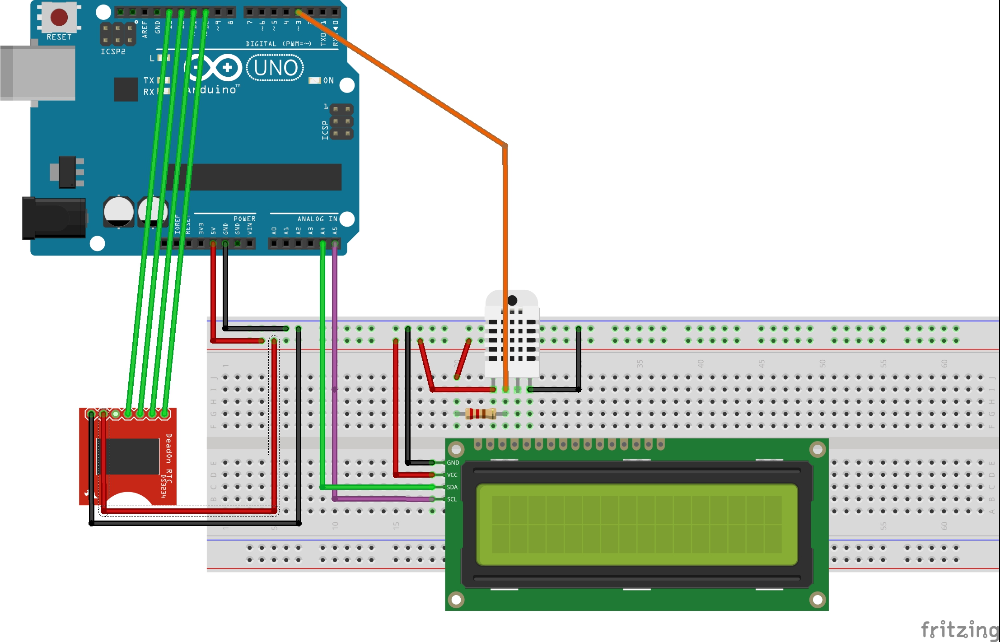

# StationMeteo
Station Météo DIY impliquant un arduino uno, une horloge rtc, un capteur de température et d'humidité et un ecran LCD

Code Arduino pour affichage de la date et l’heure sur un écran LCD à partir d’une horloge RTC.
L’écran affiche aussi la température et l’humidité.

Matériel :

* capteur de température et d’humidité DHT22 : voir le [lien DHT22](https://create.arduino.cc/projecthub/achraf-oukheir/weather-sensors-between-dht11-and-dht22-60bb4f?ref=tag&ref_id=temperature&offset=1) et la [librairie](https://github.com/adafruit/DHT-sensor-library)
* écran LCD 16 x 2 caractères avec interface série I2C :
   * 2 fils, voir [documentation pdf](https://www.gotronic.fr/pj2-sbc-lcd16x2-fr-1441.pdf),
      * communication série : connecter SLC vers A5 et SLA vers A4.
      * plus les 2 fils d’alimentation (+5V, GROUND)
   * **ATTENTION** : utiliser la librairie Newliquidcrystal, (version 1.3.5 is possible) à télécharger [là](https://bitbucket.org/fmalpartida/new-liquidcrystal/downloads).
* horloge temps réel RTC Breakout – DS3234 avec pile 1225. Ce composant est censé être très précis. Permet de garder l’heure même si on débranche l’arduino ! 
  liaison SPI, [tutoriel](https://learn.sparkfun.com/tutorials/deadon-rtc-breakout-hookup-guide?_ga=2.135879217.1217604853.1540041757-1824790857.1517077689). Connexion : 
  * mosi au pin 11 de l’arduino, 
  * miso au pin 12, 
  * ss au pin 10 (défini dans le code par #define DS13074_CS_PIN 10, permet d’identifier le composant (slave)) 
  * clk au pin 13 
  * alimentation (+5V, et GROUND). 
  * On n’utilise pas le pin sqw (alarme).
* DTH22 : capteur de température et d'humidité numérique, connecter :
   * pin 1 vers +5V
   * pin 2 du DHT22 vers pin 3 de l’arduino (on peut choisir un autre pin en modifiant la ligne de code : #define DHTPIN 3)
   * pin 4 vers GROUND
   * Ajouter une résistance d’environ 10k en le pin 2 du composant (données) et le pin 1 du composant (+5V)

Le code permet d'afficher sur la première ligne de l'écran : heure:minutes jour/mois 'nom du jour'. 
Sur la deuxième ligne la température et l'humidité.

Remarques :

1. On a fait le choix de ne pas afficher les secondes et de rafraichir toutes les minutes parce que la librairie LiquidCrystal ne permet pas d'utiliser plusieurs "threads" en parallèle. On est donc obligé de faire toutes les actions dans la boucle principale. On ne peut pas rafraichir toute les secondes, parce que les opérations peuvent durer plus d'une seconde. Voilà.
2. **Il faut initialiser explicitement la date et l'heure quand on téléverse le croquis**, avec la méthode avec 'rtc.setTime', parce que la méthode 'rtc.autoTime' initialise l'horloge au moment où l'EDI Arduino a été lancé et non au moment de la compilation!
   * Dans un premier temps, téléverser le croquis avec `rtc.setTime(0, 55, 10, 1, 28, 10, 18);` avec la bonne heure et la bonne date - ici 0 secondes, 55 minutes, 10 heures, dimanche(1), le 28/10/2018.
   * Dans un second temps, commenter cette ligne et téléverser à nouveau. Cela permet de pouvoir de presser le bouton reset sans définir à nouveau l'heure dans l'horloge.
3. On peut remplacer le capteur numérique DTH22 par un capteur de température analogique lm35 par exemple.
4. Noter que l'horloge DS3234 fait le changement d'heure automatiquement.

Amusez-vous bien!

TODO:

1. Utiliser la mémoire eeprom de l'Arduino pour faire un relevé de la température et de l'humidité chaque jour, par exemple.
2. On pourrait ajouter deux boutons pressoir pour régler l'heure, mais ça n'est pas trivial car on ne peut pas utiliser plusieurs threads en parallèle.
